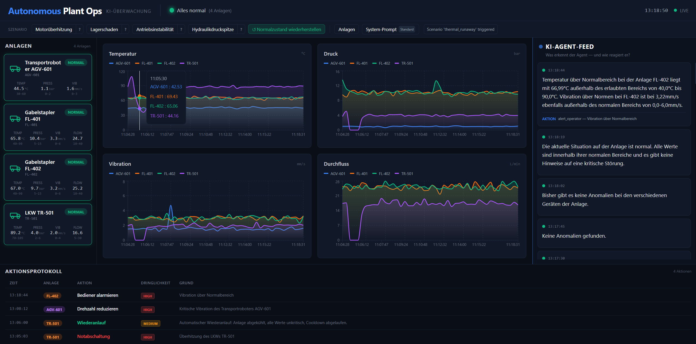
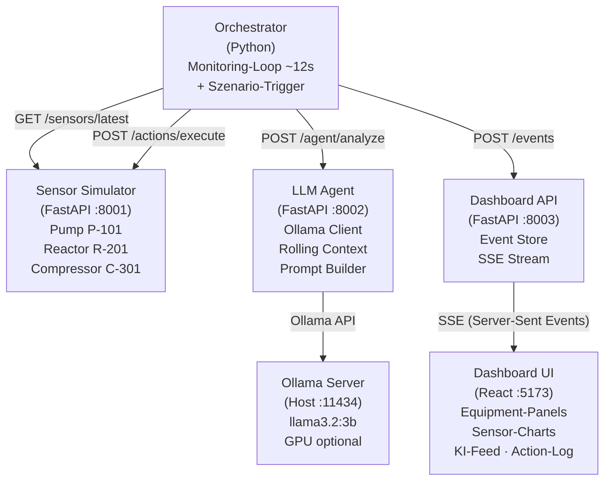

```
     _         _                                              ____  _             _      ___
    / \  _   _| |_ ___  _ __   ___  _ __ ___   ___  _   ___ |  _ \| | __ _ _ __ | |_   / _ \ _ __  ___
   / _ \| | | | __/ _ \| '_ \ / _ \| '_ ` _ \ / _ \| | | / _| |_) | |/ _` | '_ \| __| | | | | '_ \/ __|
  / ___ \ |_| | || (_) | | | | (_) | | | | | | (_) | |_| \__ \  __/| | (_| | | | | |_  | |_| | |_) \__ \
 /_/   \_\__,_|\__\___/|_| |_|\___/|_| |_| |_|\___/ \__,_|___/_|   |_|\__,_|_| |_|\__|  \___/| .__/|___/
                                                                                               |_|
```

<div align="center">

**KI-gesteuerte autonome Ueberwachung industrieller Anlagen in Echtzeit**

`Ollama LLM` | `React Dashboard` | `Docker Compose` | `100% lokal`

</div>

<br/>

<div align="center">
  
  <br/>
  <sub>Live-Dashboard: Echtzeit-Sensordaten, KI-Analyse mit LLM-Reasoning, automatische Gegenmassnahmen — Reactor R-201 Thermal Runaway erkannt und autonom heruntergefahren.</sub>
</div>

<br/>

---

## Ueberblick

**Autonomous Plant Ops** ist ein vollstaendig lokales, KI-gestuetztes System zur Ueberwachung industrieller Anlagen. Ein lokales LLM analysiert Sensordaten in Echtzeit, erkennt Anomalien und fuehrt autonom Gegenmassnahmen durch — komplett ohne Cloud.

**Was passiert im Screenshot oben?**
Der Reactor R-201 durchlaeuft ein *Thermal Runaway*-Szenario. Die Temperatur steigt auf 264°C (normal: 150-200°C), der KI-Agent erkennt die kritische Anomalie, erklaert sein Reasoning und faehrt den Reaktor autonom herunter. Gleichzeitig erkennt er erhoehte Vibration am Compressor C-301 und reduziert dessen Drehzahl. Das alles geschieht vollautomatisch — der Mensch beobachtet nur.

### Highlights

- **Echtes LLM-Reasoning** — Llama 3.2 (3B) via Ollama analysiert Sensordaten und liefert strukturierte JSON-Antworten mit natuerlichsprachlicher Begruendung
- **Autonome Gegenmassnahmen** — Shutdown, Kuehlung erhoehen, Drehzahl reduzieren — alles automatisch
- **Realistische Sensorsimulation** — 3 Equipment-Typen mit physikbasiertem Rauschen und 4 Fehlszenarien
- **Echtzeit-Dashboard** — React + Tailwind mit SSE-Streaming, animierten Equipment-Icons und Gradient-Charts
- **Vollautomatische Demo** — Orchestrator triggert zufaellige Szenarien, der KI-Agent reagiert live
- **Vollstaendig containerisiert** — Ein `docker compose up --build` und alles laeuft

---

## Architektur



**Datenfluss — alles läuft über den Orchestrator:** Der LLM Agent spricht nie direkt mit dem Frontend oder der Dashboard API. Er kennt das Dashboard gar nicht und führt selbst keine Aktionen aus — er liefert auf `POST /agent/analyze` lediglich ein JSON-Objekt mit `anomalies`, `reasoning` und `actions` zurück. Der Orchestrator ist die einzige Komponente, die mit allen anderen Services redet; Agent, Sensor Simulator und Dashboard API kennen sich gegenseitig nicht. Pro Zyklus:

1. **Analyse** — Orchestrator ruft `POST /agent/analyze` auf, der Agent antwortet mit JSON.
2. **Analyse ans Dashboard** — Orchestrator pusht die Agent-Antwort als `agent_analysis`-Event via `POST /events` an die Dashboard API.
3. **Aktionen ausführen** — Für jede Aktion ruft der Orchestrator `POST /actions/execute` am **Sensor Simulator** auf (nicht der Agent).
4. **Aktionsergebnis ans Dashboard** — Das Ergebnis wird als separates `action_executed`-Event an die Dashboard API gepusht.
5. **Frontend** — Die Dashboard API streamt alle Events per **SSE** ans React-Frontend.

Kurz: **LLM Agent → (JSON) → Orchestrator → POST /events → Dashboard API → SSE → Frontend**.

### Der 5-Sekunden-Monitoring-Loop

Der Orchestrator-Container fuehrt alle ~12 Sekunden folgenden Zyklus aus:

| Schritt | Aktion | Beschreibung |
|---------|--------|-------------|
| 1 | **Sensordaten abrufen** | `GET /sensors/latest` vom Sensor Simulator |
| 2 | **Dashboard updaten** | Sensor-Readings live ans Dashboard pushen |
| 3 | **LLM-Analyse** | `POST /agent/analyze` -- Ollama analysiert die Daten |
| 4 | **Anomalien pruefen** | Wenn Anomalien erkannt: Aktionen extrahieren |
| 5 | **Aktionen ausfuehren** | `POST /actions/execute` am Sensor Simulator |
| 6 | **Ergebnis pushen** | Analyse + Aktionen ans Dashboard senden |

Zusaetzlich triggert der Orchestrator zufaellig Fehlszenarien (~8% pro Zyklus), sodass die Demo autonom laeuft.

---

## Schnellstart

> **Cluster/Produktiv → Kubernetes (Helm). Lokal/Demo → Docker Compose.**

### Kubernetes (empfohlen)

Das Chart ist als Helm-Repo veröffentlicht — Installation in drei Zeilen:

```bash
helm repo add autonomous-plant-ops https://thotischner.github.io/autonomous-plant-ops
helm repo update
helm install plant-ops autonomous-plant-ops/autonomous-plant-ops
```

Standardmäßig erwartet das Chart einen **externen Ollama-Endpoint**. Der Ollama-Modus ist per Flag wählbar:

```bash
# Externer Ollama-Endpoint (Standard)
helm install plant-ops autonomous-plant-ops/autonomous-plant-ops \
  --set ollama.external.host=http://my-ollama-host:11434

# Ollama im Cluster (inkl. PVC für Modelle)
helm install plant-ops autonomous-plant-ops/autonomous-plant-ops \
  --set ollama.mode=in-cluster

# Ollama im Cluster mit GPU
helm install plant-ops autonomous-plant-ops/autonomous-plant-ops \
  --set ollama.mode=in-cluster \
  --set ollama.inCluster.gpu.enabled=true
```

Bei In-Cluster-Ollama das Modell einmalig pullen (Hinweis erscheint nach `helm install`):

```bash
kubectl exec deploy/ollama -- ollama pull llama3.2:3b
```

Alternativ direkt aus dem Repo-Checkout: `helm install plant-ops helm/autonomous-plant-ops`. Konfiguration in `helm/autonomous-plant-ops/values.yaml` (validiert über `values.schema.json`). Images sind auf `Chart.AppVersion` gepinnt und Multi-Arch (linux/amd64 + linux/arm64) — kein `:latest`.

**Designentscheidungen:**

- **Feste Service-Namen** — die K8s-Service-Namen entsprechen 1:1 den Compose-Namen, damit hartkodierte URLs / `nginx.conf` unverändert funktionieren.
- **Ollama per Toggle** — `ollama.mode` schaltet extern ⇄ in-cluster; `OLLAMA_HOST` wird automatisch aufgelöst.
- **Orchestrator** — Deployment ohne Service, fix 1 Replica (mehrere würden Szenarien doppelt triggern).
- **Ingress (nginx)** — Route aufs Frontend, `proxy-buffering: off` + lange Timeouts, damit der SSE-Stream offen bleibt.

<details>
<summary>CI / Release / ArtifactHub</summary>

| Workflow | Trigger | Aufgabe |
|---|---|---|
| `images.yml` | Push/PR + Tag `v*` | Pro Service Lint+Tests, dann Multi-Arch-Image (amd64/arm64) nach GHCR; bei Tag `vX.Y.Z` → `:X.Y.Z` |
| `helm-ci.yml` | Chart-Änderungen | `chart-testing` lint, kind-Cluster, `helm install`, Smoke-Test gegen alle `/health` + Ingress |
| `chart-release.yml` | Push auf `main` (`helm/**`) | `chart-releaser` paketiert & veröffentlicht das Chart auf `gh-pages` + `artifacthub-repo.yml` |

**Release-Flow:** `appVersion`/`version` in `Chart.yaml` bumpen → Git-Tag `vX.Y.Z` pushen (baut `:X.Y.Z`-Images) → Chart-PR mergen (publiziert Chart) → GitHub Release anlegen.
</details>

### Docker Compose (lokal / Demo)

| Anforderung | Details |
|-------------|---------|
| **Docker & Docker Compose** | Version 2.x empfohlen |
| **RAM** | Mindestens 8 GB (fuer Ollama LLM) |
| **GPU** | Optional -- Ollama laeuft auch auf CPU |
| **Ports** | 5173, 8001, 8002, 8003, 11434 muessen frei sein |

```bash
git clone https://github.com/ThoTischner/autonomous-plant-ops.git
cd autonomous-plant-ops
```

Ollama muss auf dem **Host** laufen (nicht im Container) für GPU-Zugriff:

```bash
# Windows PowerShell:
$env:OLLAMA_HOST="0.0.0.0"; ollama serve
# Zweites Terminal:
ollama pull llama3.2:3b
```

Dann alle Services bauen und starten:

```bash
docker compose up --build -d
```

Das war's — der **Orchestrator** startet den Monitoring-Loop und triggert automatisch Fehlszenarien. Dashboard öffnen:

```
http://localhost:5173
```

Nach ~15 Sekunden erscheinen die ersten Sensordaten und KI-Analysen.

| Service | URL |
|---------|-----|
| Dashboard UI | http://localhost:5173 |
| Orchestrator | kein HTTP-Endpoint (`docker compose logs -f orchestrator`) |
| Sensor Simulator API | http://localhost:8001 |
| LLM Agent API | http://localhost:8002 |
| Dashboard API | http://localhost:8003 |
| Ollama (Host) | http://localhost:11434 |

---

## Tech Stack

| Technologie | Rolle | Port |
|-------------|-------|------|
| **Ollama** (llama3.2:3b) | Lokales LLM fuer Anomalieerkennung und Reasoning | `11434` (Host) |
| **FastAPI** (Python) | Sensor Simulator, LLM Agent, Dashboard API | `8001`, `8002`, `8003` |
| **Orchestrator** (Python) | Autonomer Monitoring-Loop mit Szenario-Trigger | -- |
| **React + TypeScript** | Echtzeit-Dashboard mit Tailwind CSS | `5173` |
| **Recharts + Framer Motion** | Gradient-Charts und animierte Equipment-Icons | -- |
| **SSE (Server-Sent Events)** | Echtzeit-Streaming zum Dashboard | -- |
| **Docker Compose / Helm** | Container-Orchestrierung (lokal / Kubernetes) | -- |
| **Nginx** | Reverse Proxy + SSE Proxy fuer das Frontend | -- |

---

## Features

### Realistische Sensorsimulation

Drei Equipment-Typen mit physikbasiertem Rauschen und konfigurierbaren Normalbereichen:

| Equipment | ID | Temperatur | Druck | Vibration | Durchfluss |
|-----------|----|-----------|-------|-----------|------------|
| Pumpe | `P-101` | 60--80 C | 2--4 bar | 0--5 mm/s | 100--150 L/min |
| Reaktor | `R-201` | 150--200 C | 5--10 bar | 0--3 mm/s | -- |
| Kompressor | `C-301` | 40--70 C | 6--12 bar | 0--8 mm/s | 200--300 m^3/h |

### LLM-basierte Anomalieerkennung

Das LLM erhaelt die aktuellen Sensordaten, historische Messwerte und kuerzlich ausgefuehrte Aktionen. Es antwortet mit strukturiertem JSON:

```json
{
  "anomalies": [
    {
      "equipment_id": "R-201",
      "sensor": "temperature",
      "value": 245.3,
      "normal_range": "150-200 C",
      "severity": "critical"
    }
  ],
  "reasoning": "Die Temperatur des Reaktors R-201 liegt bei 245.3 C und damit deutlich ueber dem Normalbereich. In Kombination mit dem steigenden Druck deutet dies auf einen thermischen Durchgaenger hin. Sofortiges Herunterfahren empfohlen.",
  "actions": [
    {
      "equipment_id": "R-201",
      "action": "shutdown_equipment",
      "reason": "Kritische Uebertemperatur mit Druckanstieg",
      "urgency": "critical",
      "parameters": {}
    }
  ]
}
```

### Autonome Gegenmassnahmen

| Aktion | Beschreibung | Typischer Ausloeser |
|--------|-------------|---------------------|
| `shutdown_equipment` | Sofortige Abschaltung | Kritische Anomalien |
| `increase_cooling` | Kuehlleistung erhoehen (Faktor +0.2) | Uebertemperatur |
| `reduce_speed` | Drehzahl reduzieren (Faktor -0.15) | Erhoehte Vibration |
| `adjust_setpoint` | Sollwerte zuruecksetzen | Nach Stoerungsbehebung |
| `alert_operator` | Bediener alarmieren | Mittlere Anomalien |
| `no_action` | Keine Massnahme | Alles im Normbereich |

### 4 Fehlszenarien

| Szenario | Equipment | Dauer | Beschreibung |
|----------|-----------|-------|-------------|
| `thermal_runaway` | R-201 | 30 s | Temperatur steigt um +3 C/s, Druck um +0.3 bar/s |
| `bearing_degradation` | P-101 | 40 s | Vibration steigt um +0.25 mm/s pro Sekunde |
| `compressor_surge` | C-301 | 25 s | Druck oszilliert +/-1.5 bar, Durchfluss faellt |
| `pressure_spike` | R-201 | 15 s | Druckanstieg um +1.0 bar/s |

### Echtzeit-Dashboard

- **Header** mit Live-Statusindikator (Connected/Disconnected)
- **Equipment-Panels** mit animierten Icons und Statusanzeige
- **Sensor-Charts** mit Gradient-Verlauf und Normbereichsmarkierungen
- **KI-Reasoning-Feed** -- die Begruendungen des LLM in Echtzeit
- **Action-Log** -- alle ausgefuehrten Gegenmassnahmen chronologisch


---

## Demo-Szenarien

### 1. Thermal Runaway (Thermischer Durchgaenger)

**Was passiert:** Die Reaktortemperatur steigt ueber 30 Sekunden um +3 C/s, begleitet von steigendem Druck.

```bash
curl -X POST http://localhost:8001/scenarios/trigger \
  -H "Content-Type: application/json" \
  -d '{"scenario": "thermal_runaway"}'
```

**Im Dashboard beobachten:**
- Temperatur-Chart von R-201 steigt steil an
- KI-Feed zeigt Warnung mit Begruendung
- Action-Log zeigt `increase_cooling`, dann `shutdown_equipment`

**Erwartete KI-Reaktion:** Erkennt Uebertemperatur, empfiehlt zunaechst Kuehlung, bei anhaltendem Anstieg Notabschaltung.

---

### 2. Bearing Degradation (Lagerverschleiss)

**Was passiert:** Die Pumpenvibration steigt ueber 40 Sekunden graduell an -- typisches Zeichen fuer Lagerverschleiss.

```bash
curl -X POST http://localhost:8001/scenarios/trigger \
  -H "Content-Type: application/json" \
  -d '{"scenario": "bearing_degradation"}'
```

**Im Dashboard beobachten:**
- Vibrations-Chart von P-101 steigt langsam
- Temperatur steigt leicht mit (+0.5 C/s)
- KI erkennt Korrelation zwischen Vibration und Temperatur

**Erwartete KI-Reaktion:** Erkennt Vibrationszunahme, empfiehlt Drehzahlreduktion und Operatoralarm.

---

### 3. Compressor Surge (Kompressor-Pumpen)

**Was passiert:** Druckoszillationen am Kompressor mit fallendem Durchfluss -- klassisches Surge-Muster.

```bash
curl -X POST http://localhost:8001/scenarios/trigger \
  -H "Content-Type: application/json" \
  -d '{"scenario": "compressor_surge"}'
```

**Im Dashboard beobachten:**
- Druck-Chart von C-301 oszilliert (+/-1.5 bar)
- Durchfluss faellt kontinuierlich
- Vibration steigt

**Erwartete KI-Reaktion:** Erkennt Surge-Muster, empfiehlt Drehzahlreduktion und ggf. Abschaltung.

---

### 4. Pressure Spike (Druckspitze)

**Was passiert:** Ploetzlicher Druckanstieg im Reaktor ueber 15 Sekunden.

```bash
curl -X POST http://localhost:8001/scenarios/trigger \
  -H "Content-Type: application/json" \
  -d '{"scenario": "pressure_spike"}'
```

**Im Dashboard beobachten:**
- Druck-Chart von R-201 steigt schnell
- KI reagiert innerhalb von 1--2 Zyklen

**Erwartete KI-Reaktion:** Erkennt kritischen Druckanstieg, empfiehlt sofortige Druckentlastung oder Abschaltung.

---

### Szenario via Skript ausloesen

```bash
# Standard: thermal_runaway
./scripts/trigger-scenario.sh

# Bestimmtes Szenario
./scripts/trigger-scenario.sh bearing_degradation

# Szenario auf bestimmtem Equipment
./scripts/trigger-scenario.sh compressor_surge C-301
```

---

## Projektstruktur

```
autonomous-plant-ops/
|
|-- docker-compose.yml              # Alle 6 Services + Netzwerk + Volumes
|
|-- sensor-simulator/               # Physik-basierte Sensorsimulation
|   |-- Dockerfile
|   |-- requirements.txt
|   +-- src/
|       |-- main.py                  # FastAPI App + Startup
|       |-- equipment.py             # Equipment-Definitionen (P-101, R-201, C-301)
|       |-- simulator.py             # Simulator-Engine mit Drift und Rauschen
|       |-- scenarios.py             # 4 Fehlszenarien (async)
|       |-- models.py                # Pydantic-Modelle
|       +-- routes/
|           |-- sensors.py           # GET /sensors/latest, /sensors/history
|           |-- actions.py           # POST /actions/execute
|           +-- scenarios.py         # POST /scenarios/trigger, GET /scenarios/list
|
|-- llm-agent/                       # KI-Agent mit Ollama-Anbindung
|   |-- Dockerfile
|   |-- requirements.txt
|   +-- src/
|       |-- main.py                  # FastAPI App
|       |-- agent.py                 # AnalysisAgent -- Kern der KI-Logik
|       |-- prompts.py               # System- und User-Prompts (deutsch)
|       |-- context.py               # Rolling Context (Historie + Aktionen)
|       |-- models.py                # Pydantic-Modelle (Request/Response/Anomaly)
|       +-- routes/
|           +-- analyze.py           # POST /agent/analyze
|
|-- dashboard/
|   |-- api/                         # Event Store + SSE Streaming
|   |   |-- Dockerfile
|   |   |-- requirements.txt
|   |   +-- src/
|   |       |-- main.py              # FastAPI App
|   |       |-- models.py            # Event, EventType
|   |       |-- store.py             # In-Memory Event Store mit Pub/Sub
|   |       +-- routes/
|   |           +-- events.py        # POST/GET /events, GET /events/stream (SSE)
|   |
|   +-- frontend/                    # React + TypeScript Dashboard
|       |-- Dockerfile
|       |-- package.json
|       |-- vite.config.ts
|       |-- tailwind.config.js
|       |-- nginx.conf               # Reverse Proxy Konfiguration
|       +-- src/
|           |-- App.tsx              # Haupt-App-Komponente
|           |-- main.tsx             # Entry Point
|           |-- index.css            # Tailwind Styles
|           |-- types/index.ts       # TypeScript Typdefinitionen
|           |-- hooks/
|           |   +-- useEventStream.ts  # SSE Hook
|           +-- components/
|               |-- PlantOverview.tsx    # Gesamtuebersicht
|               |-- EquipmentPanel.tsx   # Equipment-Liste
|               |-- EquipmentCard.tsx    # Einzelnes Equipment
|               |-- SensorCharts.tsx     # Chart-Container
|               |-- SensorChart.tsx      # Einzelner Sensor-Chart
|               |-- AgentFeed.tsx        # KI-Reasoning-Feed
|               +-- ActionLog.tsx        # Aktions-Protokoll
|
|-- n8n/
|   +-- workflows/
|       |-- main-monitoring-loop.json   # Haupt-Monitoring (5-Sek.-Loop)
|       +-- alert-escalation.json       # Eskalationsworkflow
|
+-- scripts/
    |-- setup.sh                     # Komplettes Setup (Build + Model Pull)
    +-- trigger-scenario.sh          # Szenario-Trigger Helper
```

---

## API-Referenz

### Sensor Simulator (Port 8001)

#### Health Check

```bash
curl http://localhost:8001/health
```

#### Aktuelle Sensordaten aller Equipments

```bash
curl http://localhost:8001/sensors/latest
```

**Response:**
```json
[
  {
    "equipment_id": "P-101",
    "equipment_name": "Pump P-101",
    "temperature": 72.4,
    "pressure": 3.1,
    "vibration": 2.8,
    "flow_rate": 128.5,
    "status": "running"
  },
  {
    "equipment_id": "R-201",
    "equipment_name": "Reactor R-201",
    "temperature": 178.2,
    "pressure": 7.4,
    "vibration": 1.2,
    "flow_rate": null,
    "status": "running"
  }
]
```

#### Sensordaten eines bestimmten Equipments

```bash
curl http://localhost:8001/sensors/latest/P-101
```

#### Sensor-Historie

```bash
# Letzte 60 Messwerte (Standard)
curl http://localhost:8001/sensors/history/R-201

# Letzte 120 Messwerte
curl "http://localhost:8001/sensors/history/R-201?limit=120"
```

#### Aktion ausfuehren

```bash
curl -X POST http://localhost:8001/actions/execute \
  -H "Content-Type: application/json" \
  -d '{
    "equipment_id": "R-201",
    "action": "shutdown_equipment",
    "reason": "Kritische Uebertemperatur"
  }'
```

**Response:**
```json
{
  "success": true,
  "equipment_id": "R-201",
  "action": "shutdown_equipment",
  "message": "Reactor R-201 shut down"
}
```

**Verfuegbare Aktionen:** `shutdown_equipment`, `increase_cooling`, `reduce_speed`, `adjust_setpoint`, `alert_operator`, `no_action`

#### Szenario ausloesen

```bash
curl -X POST http://localhost:8001/scenarios/trigger \
  -H "Content-Type: application/json" \
  -d '{"scenario": "thermal_runaway"}'
```

**Response:**
```json
{
  "success": true,
  "message": "Scenario 'thermal_runaway' triggered"
}
```

#### Verfuegbare Szenarien auflisten

```bash
curl http://localhost:8001/scenarios/list
```

**Response:**
```json
["thermal_runaway", "bearing_degradation", "compressor_surge", "pressure_spike"]
```

---

### LLM Agent (Port 8002)

#### Health Check

```bash
curl http://localhost:8002/health
```

#### Sensordaten analysieren

```bash
curl -X POST http://localhost:8002/agent/analyze \
  -H "Content-Type: application/json" \
  -d '{
    "sensors": [
      {
        "equipment_id": "R-201",
        "equipment_name": "Reactor R-201",
        "temperature": 245.3,
        "pressure": 12.8,
        "vibration": 2.1,
        "status": "running"
      }
    ]
  }'
```

**Response:**
```json
{
  "anomalies": [
    {
      "equipment_id": "R-201",
      "sensor": "temperature",
      "value": 245.3,
      "normal_range": "150-200 C",
      "severity": "critical"
    }
  ],
  "reasoning": "Die Temperatur des Reaktors R-201 liegt mit 245.3 C weit ueber dem Normalbereich...",
  "actions": [
    {
      "equipment_id": "R-201",
      "action": "shutdown_equipment",
      "reason": "Kritische Uebertemperatur",
      "urgency": "critical",
      "parameters": {}
    }
  ],
  "timestamp": "2026-03-19T14:23:45.123Z"
}
```

---

### Dashboard API (Port 8003)

#### Health Check

```bash
curl http://localhost:8003/health
```

#### Event erstellen

```bash
curl -X POST http://localhost:8003/events \
  -H "Content-Type: application/json" \
  -d '{
    "event_type": "anomaly_detected",
    "data": {"equipment_id": "R-201", "sensor": "temperature", "value": 245.3},
    "equipment_id": "R-201",
    "severity": "critical"
  }'
```

#### Events abrufen

```bash
# Alle Events (letzte 100)
curl http://localhost:8003/events

# Gefiltert nach Typ
curl "http://localhost:8003/events?event_type=anomaly_detected&limit=50"
```

**Event-Typen:** `sensor_reading`, `anomaly_detected`, `action_executed`, `agent_analysis`, `scenario_triggered`

#### SSE Event Stream

```bash
curl -N http://localhost:8003/events/stream
```

Empfaengt Events in Echtzeit als Server-Sent Events. Das Dashboard nutzt diesen Endpunkt fuer Live-Updates.

---

## n8n Workflows

### Main Monitoring Loop

**Datei:** `n8n/workflows/main-monitoring-loop.json`

Der Hauptworkflow laeuft als Endlosschleife mit 5-Sekunden-Intervall:

```
[Schedule Trigger] --> [HTTP: Sensordaten] --> [HTTP: LLM Analyse]
       ^                                            |
       |                                            v
       |                                    [IF: Anomalien?]
       |                                     /          \
       |                                   Ja           Nein
       |                                   |              |
       |                              [HTTP: Aktion]      |
       |                              [HTTP: Dashboard] <--+
       +--------------------------------------------------+
```

| Node | Beschreibung |
|------|-------------|
| **Schedule Trigger** | Loest alle 5 Sekunden aus |
| **HTTP: Sensordaten** | `GET http://sensor-simulator:8001/sensors/latest` |
| **HTTP: LLM Analyse** | `POST http://llm-agent:8002/agent/analyze` |
| **IF: Anomalien?** | Prueft ob `anomalies` Array nicht leer |
| **HTTP: Aktion** | `POST http://sensor-simulator:8001/actions/execute` |
| **HTTP: Dashboard** | `POST http://dashboard-api:8003/events` |

### Alert Escalation

**Datei:** `n8n/workflows/alert-escalation.json`

Wird ueber Webhook getriggert, wenn kritische Anomalien erkannt werden. Kann erweitert werden fuer E-Mail, Slack oder andere Benachrichtigungen.

### Workflows importieren

1. n8n oeffnen: [http://localhost:5678](http://localhost:5678)
2. Klick auf **"+"** fuer neuen Workflow
3. Menue (drei Punkte) --> **Import from File**
4. JSON-Datei auswaehlen
5. **Save** und **Activate**

---

## Dashboard

Das React-Dashboard zeigt alle Informationen in Echtzeit via SSE-Streaming:

```
+-----------------------------------------------------------------------+
|  AUTONOMOUS PLANT OPS                    [Status: Connected]          |
+-----------------------------------------------------------------------+
|                                                                       |
|  +--Equipment Panel--+  +--Sensor Charts--------------------------+  |
|  |                    |  |                                          |  |
|  |  [~] Pump P-101   |  |  Temperature    ~~~~~~~~~/^^^^          |  |
|  |      Running       |  |                 --------[Normal]---     |  |
|  |                    |  |                                          |  |
|  |  [*] Reactor R-201|  |  Pressure       ~~~~~~~/~~~~~           |  |
|  |      WARNING       |  |                 --------[Normal]---     |  |
|  |                    |  |                                          |  |
|  |  [o] Compr. C-301 |  |  Vibration      ~~~~/~~~~~~~            |  |
|  |      Running       |  |                 --------[Normal]---     |  |
|  +--------------------+  +----------------------------------------+  |
|                                                                       |
|  +--KI Reasoning Feed-----------+  +--Action Log------------------+  |
|  |                               |  |                              |  |
|  |  14:23:45 Temperatur von     |  |  14:23:46 shutdown_equipment |  |
|  |  R-201 liegt bei 245.3 C,   |  |  R-201: Kritische Uebertemp. |  |
|  |  deutlich ueber Normbereich. |  |                              |  |
|  |  Sofortiges Herunterfahren   |  |  14:23:41 increase_cooling   |  |
|  |  empfohlen.                   |  |  R-201: Temperatur steigt    |  |
|  |                               |  |                              |  |
|  +-------------------------------+  +------------------------------+  |
+-----------------------------------------------------------------------+
```

### Komponenten

| Komponente | Datei | Beschreibung |
|-----------|-------|-------------|
| **PlantOverview** | `PlantOverview.tsx` | Gesamtuebersicht mit Status |
| **EquipmentPanel** | `EquipmentPanel.tsx` | Liste aller Equipments |
| **EquipmentCard** | `EquipmentCard.tsx` | Einzelkarte mit animiertem Icon und Status |
| **SensorCharts** | `SensorCharts.tsx` | Container fuer Sensor-Graphen |
| **SensorChart** | `SensorChart.tsx` | Einzelner Chart mit Gradient und Normbereich |
| **AgentFeed** | `AgentFeed.tsx` | Echtzeit-Feed der KI-Begruendungen |
| **ActionLog** | `ActionLog.tsx` | Chronologisches Aktions-Protokoll |

### SSE-Anbindung

Der Custom Hook `useEventStream.ts` stellt die SSE-Verbindung zum Dashboard API her und verteilt Events an alle Komponenten. Automatische Reconnection bei Verbindungsverlust.

---

## Konfiguration

### Umgebungsvariablen

| Variable | Service | Standard | Beschreibung |
|----------|---------|----------|-------------|
| `OLLAMA_HOST` | llm-agent | `http://ollama:11434` | Ollama Server URL |
| `OLLAMA_MODEL` | llm-agent | `llama3.1:8b` | Verwendetes LLM-Modell |
| `N8N_HOST` | n8n | `0.0.0.0` | n8n Bind-Adresse |
| `WEBHOOK_URL` | n8n | `http://n8n:5678/` | Webhook Basis-URL |

### LLM-Modell wechseln

```bash
# In docker-compose.yml die Variable aendern:
environment:
  - OLLAMA_MODEL=mistral:7b

# Neues Modell herunterladen:
docker compose exec ollama ollama pull mistral:7b

# LLM-Agent neustarten:
docker compose restart llm-agent
```

Kompatible Modelle: `llama3.1:8b`, `llama3.2:3b`, `mistral:7b`, `gemma2:9b` und andere Ollama-Modelle mit JSON-Output-Support.

### Sensorbereiche anpassen

Die Normalbereiche werden in `sensor-simulator/src/equipment.py` definiert:

```python
EQUIPMENT: dict[str, EquipmentConfig] = {
    "P-101": EquipmentConfig(
        equipment_id="P-101",
        name="Pump P-101",
        temperature=SensorRange(60, 80, "C"),    # min, max, unit
        pressure=SensorRange(2, 4, "bar"),
        vibration=SensorRange(0, 5, "mm/s"),
        flow_rate=SensorRange(100, 150, "L/min"),
    ),
    # ...
}
```

> **Wichtig:** Bei Aenderung der Sensorbereiche muessen die Normalbereiche im LLM-Systemprompt (`llm-agent/src/prompts.py`) ebenfalls angepasst werden.

### Szenarien modifizieren

Neue Szenarien werden in `sensor-simulator/src/scenarios.py` als asynchrone Funktionen definiert und in das `SCENARIOS`-Dictionary eingetragen:

```python
async def _my_new_scenario(equipment_id: str = "P-101") -> None:
    for i in range(20):
        simulator.add_drift(equipment_id, "temperature", 2.0)
        await asyncio.sleep(1)

SCENARIOS["my_new_scenario"] = _my_new_scenario
```

---

## Entwicklung

### Docker-Only Development

Alle Services laufen ausschliesslich in Docker-Containern. Es sind keine lokalen Python- oder Node.js-Installationen noetig.

```bash
# Alle Services starten
docker compose up --build

# Einzelnen Service neustarten
docker compose restart llm-agent

# Logs eines Services anzeigen
docker compose logs -f sensor-simulator

# In einen Container einsteigen
docker compose exec llm-agent bash
```

### Neues Equipment hinzufuegen

1. **Equipment definieren** in `sensor-simulator/src/equipment.py`:
   ```python
   "T-401": EquipmentConfig(
       equipment_id="T-401",
       name="Tank T-401",
       temperature=SensorRange(20, 40, "C"),
       pressure=SensorRange(1, 2, "bar"),
       vibration=SensorRange(0, 1, "mm/s"),
   ),
   ```

2. **LLM-Prompt aktualisieren** in `llm-agent/src/prompts.py` -- den Normalbereich im Systemprompt ergaenzen

3. **Dashboard-Komponente** ggf. um neues Icon erweitern in `EquipmentCard.tsx`

### Neues Szenario hinzufuegen

1. Async-Funktion in `sensor-simulator/src/scenarios.py` erstellen
2. In das `SCENARIOS`-Dictionary eintragen
3. Testen: `curl -X POST http://localhost:8001/scenarios/trigger -H "Content-Type: application/json" -d '{"scenario": "my_scenario"}'`

### Neue Aktion hinzufuegen

1. `ActionType` Enum erweitern in `sensor-simulator/src/models.py` und `llm-agent/src/models.py`
2. Handler in `sensor-simulator/src/routes/actions.py` implementieren (im `match`-Block)
3. Aktionsbeschreibung im LLM-Systemprompt ergaenzen

### LLM-Prompt modifizieren

Der Systemprompt befindet sich in `llm-agent/src/prompts.py`. Er definiert:
- Die Rolle des Agenten
- Equipment-Normalbereiche
- Das erwartete JSON-Ausgabeformat
- Verfuegbare Aktionstypen

Aenderungen am Prompt erfordern einen Neustart des LLM-Agent-Containers:
```bash
docker compose restart llm-agent
```

---

## CI/CD

### Container-basierte Tests

```bash
# Test-Suite ausfuehren (falls docker-compose.test.yml vorhanden)
docker compose -f docker-compose.test.yml up --build --abort-on-container-exit

# Einzelnen Service testen
docker compose run --rm sensor-simulator pytest
docker compose run --rm llm-agent pytest
```

### GitHub Actions Pipeline

Empfohlene Pipeline-Schritte:

```yaml
# .github/workflows/ci.yml
name: CI
on: [push, pull_request]
jobs:
  test:
    runs-on: ubuntu-latest
    steps:
      - uses: actions/checkout@v4
      - name: Build & Test
        run: docker compose -f docker-compose.test.yml up --build --abort-on-container-exit
```

### Lokale Validierung

```bash
# Docker-Images bauen (ohne Start)
docker compose build

# Syntax-Check der Compose-Datei
docker compose config
```

---

## Troubleshooting

### Ollama-Modell laesst sich nicht herunterladen

```bash
# Status pruefen
docker compose logs ollama

# Manuell herunterladen
docker compose exec ollama ollama pull llama3.1:8b

# Kleineres Modell verwenden (weniger RAM)
docker compose exec ollama ollama pull llama3.2:3b
# Dann OLLAMA_MODEL in docker-compose.yml anpassen
```

### n8n Workflow loest nicht aus

- Ist der Workflow **aktiviert** (gruener Toggle oben rechts)?
- Sind die internen Hostnamen korrekt? Innerhalb von Docker: `sensor-simulator`, `llm-agent`, `dashboard-api` (nicht `localhost`)
- Logs pruefen: `docker compose logs -f n8n`

### Dashboard zeigt "Disconnected"

- Dashboard API laeuft? `curl http://localhost:8003/health`
- SSE-Verbindung pruefen: `curl -N http://localhost:8003/events/stream`
- Browser-Konsole auf Fehler pruefen (F12)
- Nginx-Konfiguration prufen: `docker compose logs dashboard-frontend`

### LLM liefert unbrauchbare Antworten

- Modell korrekt geladen? `docker compose exec ollama ollama list`
- Agent-Logs pruefen: `docker compose logs -f llm-agent`
- Prompt testen: Direkt ueber die API einen Request an `/agent/analyze` senden (siehe API-Referenz)
- Bei anhaltendem Problem: Groesseres Modell verwenden (z.B. `llama3.1:70b` -- benoetigt ~40 GB RAM)

### Port-Konflikte

```bash
# Pruefen welcher Prozess den Port belegt
lsof -i :8001
# oder unter Windows/WSL:
netstat -ano | findstr :8001

# Ports in docker-compose.yml aendern:
ports:
  - "9001:8001"  # Host-Port aendern
```

### Container startet nicht

```bash
# Detaillierte Logs anzeigen
docker compose logs <service-name>

# Container komplett neu bauen
docker compose down
docker compose up --build --force-recreate
```

### RAM-Probleme mit Ollama

Ollama benoetigt fuer `llama3.1:8b` ca. 6--8 GB RAM. Alternativen:

| Modell | RAM-Bedarf | Qualitaet |
|--------|-----------|-----------|
| `llama3.2:3b` | ~3 GB | Gut fuer Demos |
| `llama3.1:8b` | ~6--8 GB | Empfohlen |
| `mistral:7b` | ~5--7 GB | Gute Alternative |

---

## Lizenz

Dieses Projekt steht unter der [MIT License](LICENSE).

---

<div align="center">

**Autonomous Plant Ops** -- KI-gestuetzte Anlagenueberwachung, vollstaendig lokal.

Gebaut mit Ollama, n8n, FastAPI, React und Docker.

</div>
